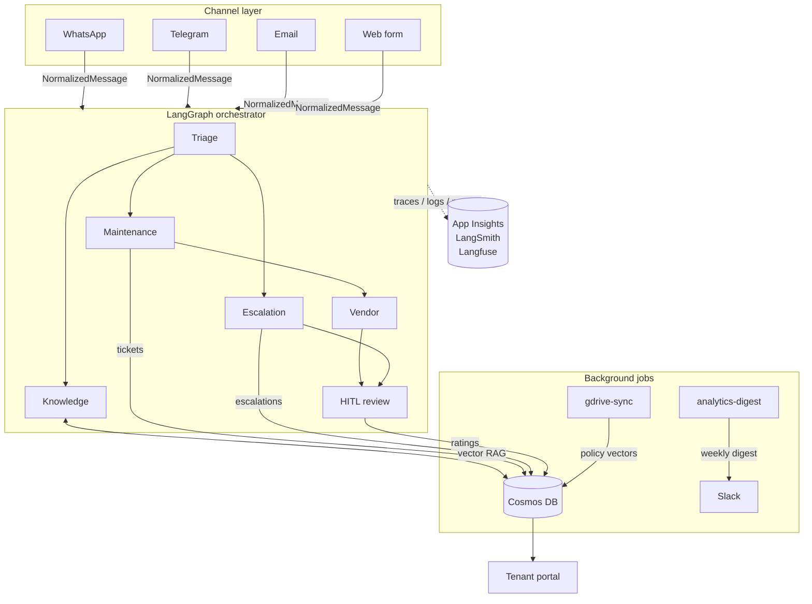
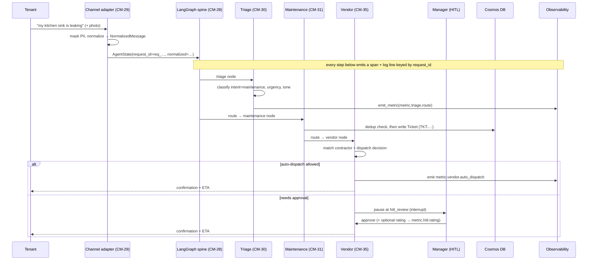

# CondoManager — Architecture Overview

> **Start here if you're new.** This is the bird's-eye map of the whole system.
> Each section links to the deep-dive doc for that area. Read this once
> top-to-bottom (~15 min) and you'll know where everything lives and why.

## 1. What is CondoManager?

A **multi-agent platform for condominium maintenance & inquiry management.**
Tenants message the platform over WhatsApp / Telegram / email / a web form. A
**LangGraph orchestrator** reads each message, decides what it is, and routes it
to a specialist **agent** (Triage → Maintenance / Knowledge / Escalation / Vendor),
with a human-in-the-loop (HITL) gate for sensitive cases. Everything is
instrumented so operators can see cost, latency, errors, and product-quality
metrics.

* **Language:** Python (agents) + TypeScript (tenant portal).
* **Brain:** LangGraph state machine + Pydantic for typed state.
* **Data:** Azure Cosmos DB (documents **and** vector search) + Key Vault for secrets.
* **Runtime:** Azure Container Apps; background jobs on Azure Functions.
* **Observability:** OpenTelemetry → App Insights + Azure Monitor; LangSmith (dev) / Langfuse (prod).

> One sentence to remember: **every tenant message becomes an `AgentState` that
> flows through a graph of nodes, and one `request_id` ties together every log,
> trace, and metric for that message.**

## 2. The 10,000-foot view



Each box is a doc:

| Area | What it does | Deep dive |
|---|---|---|
| **Channels** | Flatten every channel's payload into one `NormalizedMessage` | [`CHANNELS.md`](CHANNELS.md) |
| **Orchestrator + agents** | The LangGraph spine + the specialist agents | [`AGENTS.md`](AGENTS.md), [`TRIAGE.md`](TRIAGE.md), [`ESCALATION.md`](ESCALATION.md), [`ANALYTICS.md`](ANALYTICS.md) |
| **Background jobs** | Timer jobs: knowledge sync + weekly digest | [`FUNCTIONS.md`](FUNCTIONS.md) |
| **Tenant portal** | Read-only ticket status lookup by code | [`PORTAL.md`](PORTAL.md) |
| **Observability** | Traces, logs, metrics, dashboards, alerts | [`OBSERVABILITY.md`](OBSERVABILITY.md), [`PRODUCTION-READINESS.md`](PRODUCTION-READINESS.md) |
| **Security & compliance** | PII detection/masking, field RBAC, audit, retention | [`SECURITY.md`](SECURITY.md) |
| **Infrastructure** | Azure resources (Bicep), CI/CD | [`INFRA.md`](INFRA.md), [`CICD.md`](CICD.md) |

## 3. Follow one message through the system

This is the single most useful thing to internalize. A tenant texts *"my kitchen
sink is leaking"*:



The **same `request_id`** appears on every log line, every trace span, and every
metric event for this message — so an operator can pivot from a Slack alert to
the exact trace to the exact logs. That correlation is the backbone of
[`OBSERVABILITY.md`](OBSERVABILITY.md).

## 4. The orchestrator in one picture

The orchestrator is a `StateGraph(AgentState)`. Nodes do work; **routers** read
`state.routes[-1]` to pick the next node. Guardrails (cost cap $5/request, loop
cap 50) can short-circuit any node to a terminal stop.

```
            START
              │
              ▼
            triage ───────────────┬───────────┬──────────────┐
              │                   │           │              │
              ▼                   ▼           ▼              ▼
          maintenance         knowledge   escalation   guardrail_terminated
              │                   │           │              │
              ▼                   │           ▼              │
            vendor                │       hitl_review        │
            /     \               │           │              │
        (auto)  (approve)─────────┴───────────┴──────────────┘
           │         │                         │
           └─────────┴────────────► END ◄──────┘
```

Full node contract, `AgentState` field reference, HITL `interrupt()` contract,
and guardrail rules are in [`AGENTS.md`](AGENTS.md).

## 5. Data model — what lives in Cosmos

One Cosmos account, one `condomanager` database, several containers:

| Container | Written by | Holds |
|---|---|---|
| `tickets` | Maintenance (CM-31) | Maintenance tickets (`TKT-…`), partition `/tenantId` |
| `escalations` | Escalation (CM-32) | Escalation records + manager ratings (no TTL — audit) |
| `policies-vector` | gdrive-sync (CM-34) | Chunked + embedded policy docs for RAG |
| `checkpoints` | Orchestrator (CM-28) | LangGraph run checkpoints (30-day TTL) |
| `digests` | analytics-digest (CM-36) | Weekly digests (90-day TTL) |
| `conversations`, `tenants` | (foundation) | Conversation history, tenant records |

Cosmos doubles as the **vector store**: `VectorDistance()` returns a cosine
*similarity* (`1.0` = identical) — a subtlety that bit us once and is documented
in [`INFRA.md`](INFRA.md) §Cosmos. Secrets (API keys, connection strings) never
live in code — they're in Key Vault, read via Managed Identity.

**PII & compliance.** Tenant text is masked at both the log and trace layers
before it leaves the process, an append-only `audit` container records sensitive
access, and a retention/right-to-erasure routine backs the SOC2 posture — see
[`SECURITY.md`](SECURITY.md).

## 6. How it runs in the cloud

```
   GitHub (main)
      │  PR merged
      ▼
   GitHub Actions (OIDC, no stored creds) ── CICD.md
      │  build + deploy
      ▼
   Azure: rg-condomanager (one RG, dev + prod by tag) ── INFRA.md
      ├── Container Apps          ← the agents/orchestrator
      ├── Azure Functions         ← gdrive-sync + analytics-digest
      ├── Static Web App          ← tenant portal
      ├── Cosmos DB + Key Vault   ← data + secrets
      └── App Insights + Monitor  ← traces, dashboards, alerts
```

* **One resource group**, `dev` vs `prod` distinguished by resource name + tag.
* **OIDC-only deploys** — no long-lived cloud credentials in GitHub.
* **Infra is Bicep**, deployed by CI. See [`INFRA.md`](INFRA.md) / [`CICD.md`](CICD.md).

## 7. The "offline-first" principle (important for newcomers)

Almost every component has a **real implementation** (used in the cloud) and a
**deterministic offline fallback** (used in tests/demos), selected by an
environment variable. No `OPENAI_API_KEY`? Agents fall back to keyword
heuristics. No `COSMOS_ENDPOINT`? Repositories fall back to in-memory stores. No
App Insights connection string? Traces print to stdout.

This is why you can clone the repo and run the whole orchestrator demo with **no
credentials**:

```bash
pip install -e ".[dev]"
python -m agents.orchestrator.demo      # runs end-to-end, prints final state
pytest -q                               # the suite runs hermetic + offline
```

Look for the `get_*()` selector functions (`get_checkpointer`,
`get_ticket_repository`, `get_triage_classifier`, …) — they're the seams that
flip between real and fallback. This pattern is what keeps CI fast and the
no-credentials contract intact.

## 8. Conventions cheat-sheet

| Thing | Rule |
|---|---|
| Branches | `feature/<JIRA-KEY>-<slug>` |
| Commits | Conventional Commits, prefixed with the Jira key: `feat(area): CM-NN …` |
| PR titles | include the Jira key |
| Source of truth | Jira project **CM**; code on GitHub `main`; deep docs in `docs/` |
| Agent briefing | [`CLAUDE.md`](../CLAUDE.md) + [`AGENT_RULES.md`](../AGENT_RULES.md) |

## 9. Where to go next

* **Building an agent / touching the graph?** → [`AGENTS.md`](AGENTS.md)
* **Adding a channel?** → [`CHANNELS.md`](CHANNELS.md)
* **Wiring telemetry / a metric / a dashboard?** → [`OBSERVABILITY.md`](OBSERVABILITY.md)
* **Handling PII / audit / retention?** → [`SECURITY.md`](SECURITY.md)
* **Provisioning or deploying?** → [`INFRA.md`](INFRA.md) + [`CICD.md`](CICD.md)
* **Shipping to private beta?** → [`PRODUCTION-READINESS.md`](PRODUCTION-READINESS.md)
