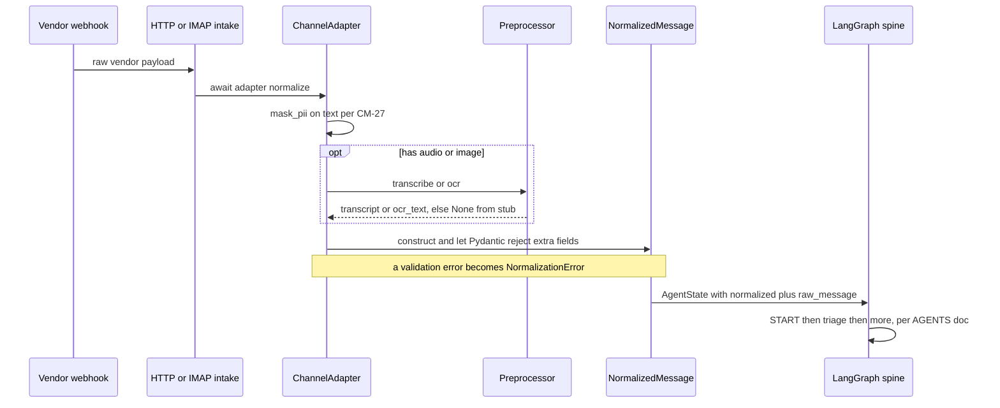

# Channel Adapters — `agents/channels/`

> Jira: **CM-29** | Epic: CM-Epic 3 (Channel Adapters) | Phase 0

## TL;DR for a new joiner

Tenants reach CondoManager over **many** channels — WhatsApp, Telegram, email,
and a web chat. Each channel hands us a **different-shaped** payload. The
job of this layer is to flatten all of them into **one** shape —
`NormalizedMessage` — so that every agent downstream (Triage, Maintenance, …)
only ever has to understand that single shape. Add a new channel later and *zero*
agent code changes.

Think of it as the **translation desk** at the front door: many languages come
in, one language goes out.

```
                          ┌──────────────────────────────────────┐
  WhatsApp  ──┐           │            Channel layer             │
  Telegram  ──┤           │  ┌─────────────┐    ┌──────────────┐ │
  Email     ──┼──raw──────┼─►│  Adapter    │───►│ Normalized   │ │──► Triage
  Web chat  ──┘  payload  │  │ .normalize()│    │  Message     │ │    (CM-30)
                          │  └─────────────┘    └──────────────┘ │     and
                          │   (one per channel)  (one shape for   │   every
                          │                       everyone)       │   agent
                          └──────────────────────────────────────┘
```

CM-29 ships the **framework**: the `NormalizedMessage` schema, the
`ChannelAdapter` protocol, a reference `WebAdapter`, and no-op preprocessor
stubs. The real WhatsApp / Telegram / Email adapters and the real
audio-transcription / image-OCR preprocessors are follow-up stories that just
fill in the slots — the contract here doesn't move.

> **Live today — the `web` channel.** The `web` channel already has a real,
> deployed implementation: the **CM-55 web chat** (`agents/webchat/`), which is
> CondoManager's public prod entry point. It reuses the reference `WebAdapter`
> below (`web.py`) to normalize, then runs the message through the triage
> pipeline. It is **TEST-only**: `POST /web/login` + `/web/message` resolve the
> sender against a **hardcoded tenant map** (`agents/webchat/tenants.py`), have
> **no auth/OTP**, and return `404` unless `WEBCHAT_TEST_ENABLED` is set. Real
> auth is a deferred follow-up — see [`SECURITY.md`](SECURITY.md) §7. The
> WhatsApp / Telegram / Email adapters remain framework stubs awaiting their
> stories.

---

## 1. The pieces

```
agents/channels/
├── schema.py            ← NormalizedMessage + Channel enum + Attachment union
├── base.py              ← ChannelAdapter Protocol + NormalizationError
├── web.py               ← reference adapter (copy this to add a new channel)
└── preprocessors/
    ├── audio.py         ← AudioTranscriber protocol + NoopAudioTranscriber stub
    └── image.py         ← ImageOcr protocol + NoopImageOcr stub
```

| Piece | What it is | Why it matters |
|---|---|---|
| `Channel` (enum) | `whatsapp` / `telegram` / `email` / `web` / `unknown` | One value per channel; `unknown` is the pre-route state inside `AgentState`. **Owned here** since CM-29 (CM-28 had a local copy). |
| `NormalizedMessage` | Frozen Pydantic model, `extra="forbid"` | The single shape every agent consumes. Schema drift fails **loudly at the adapter**, never silently at an agent. |
| `Attachment` | Discriminated union: `text` / `audio` / `image` / `file` | Lets a node `match attachment.kind:` cleanly. Audio/image carry slots (`transcript`, `ocr_text`) that preprocessors fill. |
| `ChannelAdapter` | `Protocol` with `async def normalize(raw) -> NormalizedMessage` | The interface every channel implements. Adapters are stateless and reusable across requests. |
| `NormalizationError` | Wrapper exception | Adapters wrap vendor/validation errors in this so raw `pydantic.ValidationError` never leaks schema internals to a (possibly hostile) client. |

---

## 2. `NormalizedMessage` reference

Defined in `agents/channels/schema.py`. Frozen + `extra="forbid"` — downstream
agents must **not** mutate it; they build a new `AgentState` instead (the
LangGraph idiom, via `AgentState.merge(...)` from CM-28).

| Field | Type | Notes |
|---|---|---|
| `channel` | `Channel` | Which channel produced the message. |
| `tenant_id` | `str` | Which condo association this belongs to. |
| `sender_id` | `str` | Vendor-specific id — E.164 phone / Telegram username / email address. |
| `content` | `str` | **Already PII-masked** text. Adapters call CM-27 `mask_pii(...)` *before* constructing the message; the schema does not re-mask. |
| `attachments` | `list[Attachment]` | Polymorphic — see the union below. Default empty. |
| `received_at` | `AwareDatetime` | When the **channel** saw the message (vendor clock). |
| `received_by_us_at` | `AwareDatetime` | When **our adapter** ran. |
| `upstream_message_id` | `str` | Vendor-opaque id (Twilio `MessageSid`, Telegram `update_id`, RFC-822 `Message-ID`). **Not** our `request_id`. |

Plus a computed property:

* `latency_ms` → `received_by_us_at − received_at` in ms (the channel→us hop;
  may be negative under clock skew — `abs()` it if you want a magnitude).

### Attachment kinds (discriminated on `kind`)

```
Attachment = TextAttachment | AudioAttachment | ImageAttachment | FileAttachment
```

All share `media_id` (opaque vendor id for re-fetching the blob), optional
`filename`, optional `size_bytes`. Then per-kind:

| Kind | Extra fields | Filled by |
|---|---|---|
| `text` | `content` | the adapter directly |
| `audio` | `transcript` (`None` until set), `duration_ms` | an `AudioTranscriber` preprocessor (real Azure AI Speech = follow-up) |
| `image` | `ocr_text` (`None` until set), `mime_type` | an `ImageOcr` preprocessor (real Azure AI Vision = follow-up) |
| `file` | `mime_type` | not preprocessed — a node may surface it to a human |

---

## 3. The flow — raw payload → agent input



The normalized message lands on `AgentState.normalized` (see
[`docs/AGENTS.md`](AGENTS.md) §2). From there the spine takes over.

---

## 4. Recipe — add a new channel adapter

1. **Enum value.** WhatsApp / Telegram / Email are already in `Channel`. Add a
   new one only for a genuinely new channel.
2. **Create `agents/channels/<channel>.py`.** Copy `web.py` — it's deliberately
   minimal so your divergence is visible. Swap `Channel.WEB` for your channel.
3. **Implement `async def normalize(self, raw)`.** Document the vendor payload
   shape in the class docstring. Re-fetching media (Twilio `MediaUrl`, Telegram
   `getFile`) is exactly where `async` earns its keep.
4. **Wrap errors in `NormalizationError`.** Never let `pydantic.ValidationError`
   reach the HTTP handler — it leaks schema internals to the client.
5. **PII-mask before constructing.** `content = mask_pii(text)` (CM-27). The
   schema does not re-mask.
6. **Re-export** from `agents/channels/__init__.py`.
7. **Test** in `tests/channels/test_<channel>.py` modeled on `test_web.py`:
   happy path + missing-field + extra-field + `isinstance(adapter, ChannelAdapter)`.
8. **KV secret** only if the channel needs one (Twilio auth token, etc.) — add
   it to `keyvault.bicep:secretNames` and `seed-keyvault-secrets.sh`.

### Conventions (don't fight these)

* **Async everywhere** — even sync adapters declare `async def normalize` for
  protocol uniformity.
* **No mutable per-request state on adapter instances** — they're reused across
  requests; instance attributes must be immutable config only.
* **One `Channel` value per channel** — no "Business vs Personal" split at the
  enum layer; that's vendor metadata.
* **`NormalizedMessage` is frozen** — build new `AgentState`s, never mutate.

> The in-tree quick-reference at `agents/channels/README.md` carries the same
> recipe; this doc is the operator/onboarding view. If they ever disagree, the
> **code** (`schema.py` / `base.py`) is the source of truth.

---

## 5. Preprocessors (audio / image)

`NormalizedMessage` carries slots for `transcript` (audio) and `ocr_text`
(image). CM-29 ships **no-op stubs** (`NoopAudioTranscriber`, `NoopImageOcr`)
that leave those `None` — Triage handles an absent transcript gracefully, so the
spine runs end-to-end offline today.

Wiring the real ones (Azure AI Speech / Azure AI Vision) is a follow-up: implement
the relevant protocol next to the stub, inject the vendor SDK client at
construction (real calls happen in the method, not the constructor), add the KV
secret, and select stub-vs-real by env at app boot. Each preprocessor owns its
own latency budget — CM-29's `<500ms median` AC measures only the normalization
fast path (Pydantic + adapter logic), not a real vendor round-trip.

---

## 6. Where this connects

| This layer hands off to / depends on | Doc |
|---|---|
| The LangGraph spine consumes `AgentState.normalized` | [`docs/AGENTS.md`](AGENTS.md) |
| The live `web` channel (CM-55 web chat, test-only) + its auth caveat | [`SECURITY.md`](SECURITY.md) §7, [`RUNBOOK.md`](RUNBOOK.md) |
| PII masking on `content` | [`docs/OBSERVABILITY.md`](OBSERVABILITY.md) §"Structured logging" |
| KV secrets for channel credentials | [`docs/INFRA.md`](INFRA.md) §Key Vault |
| Big-picture request lifecycle | [`docs/ARCHITECTURE.md`](ARCHITECTURE.md) |
