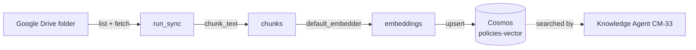

# Background Jobs — Azure Functions (`functions/`)

> Jira: **CM-34** (gdrive-sync), **CM-36** (analytics-digest) | Phase 1 / Phase 3
>
> Provisioning lives in [`docs/INFRA.md`](INFRA.md) §"Google Drive sync function"
> and §"Analytics digest job". **This doc is the architecture view** — what the
> jobs do, when they run, and the shared shape they follow.

## TL;DR for a new joiner

Not everything happens in response to a tenant message. Two things run **on a
timer**, in the background:

1. **`gdrive-sync` (CM-34)** — every 30 min, pulls policy docs out of a Google
   Drive folder and refreshes the vector index the Knowledge Agent searches.
2. **`analytics-digest` (CM-36)** — every Monday 08:00 UTC, reads the week's
   tickets + escalations and posts a manager digest to Slack.

Both are **thin shells**. The Azure Function file is just deploy-time glue:
configure logging, mint a `request_id`, wire the real implementations from env,
call one function in the `agents/` package. **All logic + tests live in
`agents/`**, so the jobs stay trivial and testable offline.

```
   ┌──────────────────────────────────────────────────────────────┐
   │  Azure Functions (Timer trigger)                               │
   │                                                                │
   │  func-…-knowledge-<env>          func-…-analytics-<env>        │
   │  every 30 min                    Mondays 08:00 UTC             │
   │  ┌────────────────────┐          ┌────────────────────┐       │
   │  │ gdrive-sync         │         │ analytics-digest    │       │
   │  │ function_app.py     │         │ function_app.py     │       │
   │  └─────────┬──────────┘          └─────────┬──────────┘       │
   └────────────┼──────────────────────────────┼──────────────────┘
                │ run_sync()                    │ run_digest()
                ▼                               ▼
        agents/knowledge/               agents/analytics/
                │                               │
   Google Drive ─┴─► Cosmos                tickets + escalations
   (policy docs)     `policies-vector`     ──► `digests` + Slack
```

## 1. The shared shape (why both jobs look identical)

Every job's `function_app.py` is the same five steps:

```python
@app.timer_trigger(schedule=..., run_on_startup=False, use_monitor=True)
def job(timer):
    configure_logging(service_name=..., environment=os.environ["ENVIRONMENT"])  # 1
    # 2. wire real impls from env (Drive/Cosmos/embedder | reader/store/notifier)
    if <anything unconfigured>:
        _log.warning("skipped — unconfigured: ...")   # 3. skip cleanly, NOT an error
        return
    with with_request_id(), with_tenant(tenant_id):    # 4. correlation rails (CM-21/27)
        report = run_*(...)                            # 5. one call into agents/
        _log.info("complete ...", report)
```

* **`run_on_startup=False`** — deploys don't trigger an unscheduled run.
* **`use_monitor=True`** — Functions tracks the schedule across restarts so a
  missed window is caught up, not silently dropped.
* **"Skipped — unconfigured" is a `WARNING`, not an error.** The app is
  provisioned *before* operators seed the KV secrets / app settings, so an
  unconfigured tick logs once and returns cleanly — it never crash-loops.
* **Correlation rails** — `with_request_id()` + `with_tenant()` mean every log
  line from the run joins to the rest of the system on `request_id` (see
  [`docs/OBSERVABILITY.md`](OBSERVABILITY.md)).

## 2. `gdrive-sync` (CM-34) — keep the knowledge base fresh

| | |
|---|---|
| **Trigger** | Timer, `0 */30 * * * *` (every 30 min, on the hour + half-hour) |
| **Entry** | `functions/gdrive-sync/function_app.py` → `agents.knowledge.run_sync(...)` |
| **Reads** | a Google Drive folder (`GDRIVE_FOLDER_ID`) of policy docs |
| **Writes** | the CM-17 `policies-vector` Cosmos container (chunked + embedded) |
| **Auth** | Google service-account JSON (KV), Azure OpenAI embeddings (KV), Cosmos via MI |

It diffs Drive against what's already indexed and reports
`changed / skipped / removed / failed` counts. This is the **write side** of the
RAG pipeline; the Knowledge Agent (CM-33, [`docs/AGENTS.md`](AGENTS.md) §9) is
the **read side** that searches what this job indexes.



Config: `COSMOS_ENDPOINT`, `GOOGLE_DRIVE_SA_KEY` (KV), `GDRIVE_FOLDER_ID`,
`GDRIVE_TENANT_ID`, `AZURE_OPENAI_*` (KV), `ENVIRONMENT`.

## 3. `analytics-digest` (CM-36) — weekly manager digest

| | |
|---|---|
| **Trigger** | Timer, `0 0 8 * * 1` (Mondays 08:00 UTC) |
| **Entry** | `functions/analytics-digest/function_app.py` → `agents.analytics.run_digest(...)` |
| **Reads** | the `tickets` (CM-31) + `escalations` (CM-32) containers |
| **Writes** | a `WeeklyDigest` to the `digests` container (partition `/tenantId`, 90-day TTL) |
| **Delivers** | posts the digest to the manager Slack channel (`SLACK_WEBHOOK_URL`, KV) |

It computes recurring issues, contractor scores, a sentiment trend, and
predictive flags. The full analyzer logic + its data-availability caveats are in
[`docs/ANALYTICS.md`](ANALYTICS.md). The `digests` container is a rolling,
rebuildable view — partly intended for the CM-37 portal to surface later.

Config: `COSMOS_ENDPOINT`, `SLACK_WEBHOOK_URL` (KV), `ANALYTICS_TENANT_ID`
(default `default`), `ENVIRONMENT`.

## 4. Deploying

Both apps deploy **out-of-band** via `func publish` (not the Bicep IaC, which
only provisions the Function App shell + app settings + KV references). The
`agents/` package is bundled into the deployment (see each app's `.funcignore` /
`requirements.txt`). See [`docs/INFRA.md`](INFRA.md) for the exact publish steps
and the MI + KV-reference wiring.

## 5. Where this connects

| Relates to | Doc |
|---|---|
| Knowledge Agent reads what gdrive-sync indexes | [`docs/AGENTS.md`](AGENTS.md) §9 |
| Analytics analyzers + caveats | [`docs/ANALYTICS.md`](ANALYTICS.md) |
| Provisioning, publish, app settings | [`docs/INFRA.md`](INFRA.md) |
| Correlation/logging rails | [`docs/OBSERVABILITY.md`](OBSERVABILITY.md) |
| Big-picture lifecycle | [`docs/ARCHITECTURE.md`](ARCHITECTURE.md) |
