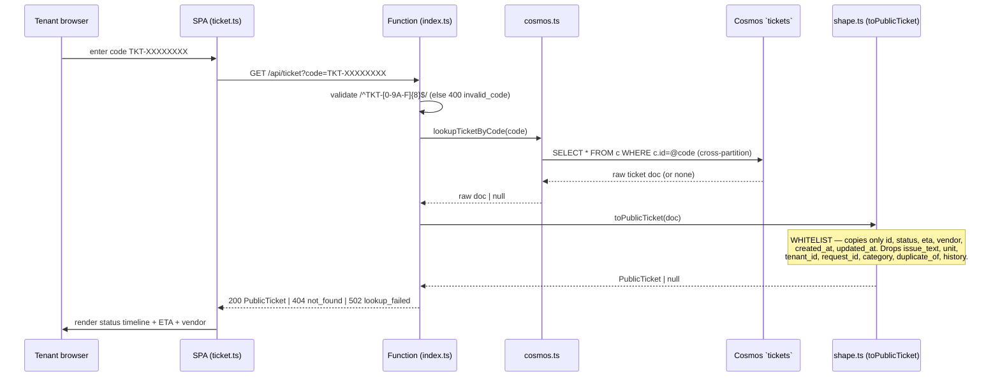

# Tenant Status Portal — `portal/`

> Jira: **CM-37** | Epic: Tenant-facing UI | Phase 2
>
> Infra/provisioning lives in [`docs/INFRA.md`](INFRA.md) §"Tenant status portal".
> **This doc is the application + architecture view** — how a request flows and
> why the security model is shaped the way it is.

## TL;DR for a new joiner

A tenant who filed a maintenance request got a confirmation code like
`TKT-3F9A1C20`. The portal is a tiny **read-only** web page where they paste that
code and see their ticket's status, ETA, and assigned vendor — **no login**.

Because there's no login, the hard rule is: **the response must never contain
PII.** Everything else falls out of that one constraint.

```
  Tenant            Static Web App (Free SKU)              Cosmos DB
  browser    ┌───────────────────────────────────┐
    │        │  ┌──────────┐      ┌─────────────┐ │
    │  code  │  │  SPA     │ /api │  managed    │ │  SELECT * FROM c
    ├───────►│  │ (TS/Vite)├─────►│  Function   ├─┼──► WHERE c.id=@code
    │        │  │ ticket.ts│ GET  │  index.ts   │ │     (tickets container)
    │◄───────┤  └──────────┘      └─────┬───────┘ │◄────────┐
    │ status │                          │ shape.ts│         │ raw doc
    │ + ETA  │                          ▼ (WHITELIST PII out)│
    │        │                    PublicTicket  ◄────────────┘
    └────────┴───────────────────────────────────┘
```

## 1. The two halves (one TypeScript stack)

| Half | Path | What it is |
|---|---|---|
| **Frontend SPA** | `portal/src/` | Vite + vanilla TypeScript. `ticket.ts` holds the pure state/format logic (unit-tested); `main.ts` is the thin DOM glue. Builds to `portal/dist`. |
| **API** | `portal/api/src/` | SWA *managed Functions* (`@azure/functions` v4). `GET /api/ticket?code=` → `index.ts` handler → `cosmos.ts` lookup → `shape.ts` projection. |

Both halves are TS/Node because that's the first-class runtime for the Static
Web Apps **Free** SKU. Pure logic is vitest-tested; the DOM glue and the Cosmos
query are deliberately thin so the testable surface is the important part.

## 2. Request flow (and where PII is stripped)



### HTTP contract (`index.ts`)

| Condition | Status | Body |
|---|---|---|
| Code fails `^TKT-[0-9A-F]{8}$` | `400` | `{ error: "invalid_code" }` |
| Cosmos query throws | `502` | `{ error: "lookup_failed" }` |
| No matching doc / invalid doc | `404` | `{ error: "not_found" }` |
| Found + valid | `200` | `PublicTicket` |

## 3. The security model — a whitelist, not a blacklist

The lookup is **unauthenticated**, so `shape.ts` is an explicit **whitelist**:
`toPublicTicket` constructs a brand-new object and copies **only** the safe
fields. It never spreads the source doc, so a field added to the `tickets`
schema tomorrow can't accidentally leak.

| `PublicTicket` field | Source | Notes |
|---|---|---|
| `id` | `doc.id` | the confirmation code |
| `status` | `doc.status` | one of `New` / `In Progress` / `Waiting` / `Resolved` |
| `statusIndex` | derived | index into `TICKET_STATES` — drives the timeline UI |
| `eta` | `doc.eta` | nullable |
| `vendor` | `doc.owner` | the assigned vendor (`owner` is renamed on the way out) |
| `created_at` / `updated_at` | same | timestamps |

**Never copied:** `issue_text`, `unit`, `tenant_id`/`tenantId`, `request_id`,
`category`, `priority`, `duplicate_of`, `history`. `toPublicTicket` returns
`null` (→ `404`) for a doc missing a valid `id`/`status`; it never throws and
never emits an unexpected field.

## 4. Data access — connection string, not Managed Identity

SWA **Free** managed Functions don't reliably support Managed Identity (that's a
Standard-tier feature), so `cosmos.ts` reads a `COSMOS_CONNECTION_STRING` **app
setting**, operator-seeded from KV `cosmos-connection-string`. The string lives
only as an Azure app setting — never in code or IaC. The placeholder `REPLACE-ME`
is treated as unset (the same CM-18 pattern used everywhere else), so the app
fails fast with a clear error before it's configured.

> **Upgrade path:** when the SWA moves to Standard, swap to
> `DefaultAzureCredential` + the CM-18 User-Assigned MI and drop the connection
> string. The query in `cosmos.ts` doesn't change.

## 5. Run it locally

```bash
cd portal && npm ci && npm run dev          # SPA on :5173
cd portal/api && npm ci && npm start        # func host for the API
```

CI's `portal` area runs `npm run lint && npm test && npm run build` for both
halves. See [`docs/INFRA.md`](INFRA.md) for provisioning, the OIDC-only deploy
(no stored deployment token), and the `PORTAL_DEPLOY_ENABLED` gate.

## 6. Where this connects

| Depends on / relates to | Doc |
|---|---|
| The `tickets` container it reads is written by the Maintenance Agent | [`docs/AGENTS.md`](AGENTS.md) §8 |
| The weekly digest reuses the same ticket data | [`docs/FUNCTIONS.md`](FUNCTIONS.md) |
| Provisioning, deploy, app settings | [`docs/INFRA.md`](INFRA.md) |
| Big-picture request lifecycle | [`docs/ARCHITECTURE.md`](ARCHITECTURE.md) |
