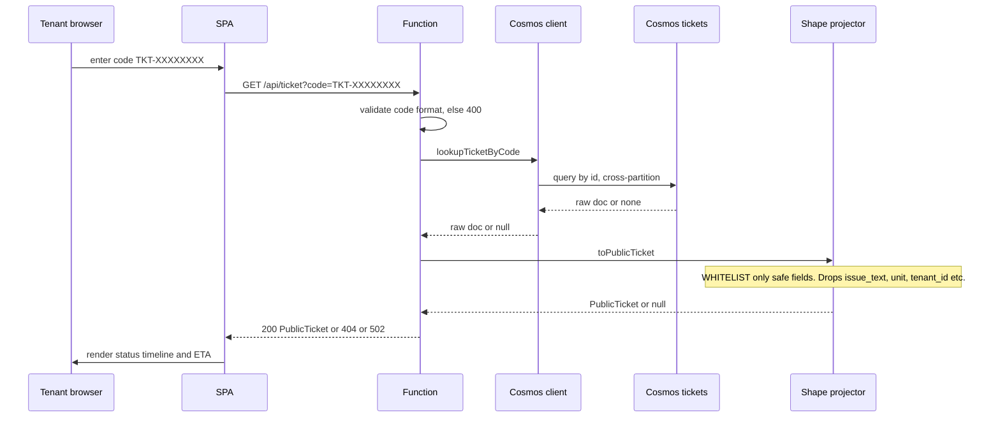

# Tenant Status Portal — `portal/`

> Jira: **CM-37** | Epic: Tenant-facing UI | Phase 2
>
> Infra/provisioning lives in [`docs/INFRA.md`](INFRA.md) §"Tenant status portal".
> **This doc is the application + architecture view** — how a request flows and
> why the security model is shaped the way it is.
>
> Scope: the read-only ticket-status page (**CM-37**), the tenant admin page
> (**CM-56**, §5), and the hard-won SWA platform lessons (**CM-61**, §6).

## What is a Static Web App (SWA)? — read this first if you're new

Azure **Static Web Apps** is a managed hosting service for web front-ends. You
hand it your built static files (HTML/CSS/JS) and it serves them over a global
CDN with free HTTPS. The useful twist: it can attach a **managed Functions API** —
a small serverless backend (Azure Functions) that lives at **`/api/*` on the same
domain**. So a single SWA gives you *both* the website and its API, with no CORS
and no second host to run.

```
   one Static Web App  =  the website  +  its /api backend, same domain
   ┌──────────────────────────────────────────────────────────────┐
   │  https://<name>.azurestaticapps.net                           │
   │     /            /admin            /api/ticket   /api/tenants  │
   │   index.html   admin.html   ──►   managed Azure Functions     │
   │   (static SPA served from CDN)    (serverless backend)        │
   └──────────────────────────────────────────────────────────────┘
```

We use the **Free** SKU, whose managed functions run in a constrained, black-box
runtime (no log streaming, opaque bundling). That convenience has sharp edges —
see §6 for the ones that cost us a day of debugging.

## TL;DR for a new joiner

A tenant who filed a maintenance request got a confirmation code like
`TKT-3F9A1C20`. The portal is a tiny **read-only** web page where they paste that
code and see their ticket's status, ETA, and assigned vendor — **no login**.

Because there's no login, the hard rule is: **the response must never contain
PII.** Everything else falls out of that one constraint.

```
  Tenant            Static Web App (Free SKU)              Cosmos DB
  browser    ┌───────────────────────────────────┐
    │        │  ┌──────────┐      ┌─────────────┐ │
    │  code  │  │  SPA     │ /api │  managed    │ │  SELECT * FROM c
    ├───────►│  │ (TS/Vite)├─────►│  Function   ├─┼──► WHERE c.id=@code
    │        │  │ ticket.ts│ GET  │  index.ts   │ │     (tickets container)
    │◄───────┤  └──────────┘      └─────┬───────┘ │◄────────┐
    │ status │                          │ shape.ts│         │ raw doc
    │ + ETA  │                          ▼ (WHITELIST PII out)│
    │        │                    PublicTicket  ◄────────────┘
    └────────┴───────────────────────────────────┘
```

## 1. The two halves (one TypeScript stack)

| Half | Path | What it is |
|---|---|---|
| **Frontend SPA** | `portal/src/` | Vite + vanilla TypeScript, **multi-page**: `index.html` (ticket status), `admin.html` (tenant admin — §5), `test-chat.html` (web-chat test — see [`docs/CHANNELS.md`](CHANNELS.md)). Per-page pure logic (`ticket.ts`, `admin.ts`) is unit-tested; the `*-view.ts` files are thin DOM glue. Builds to `portal/dist`. |
| **API** | `portal/api/src/` | SWA *managed Functions* (`@azure/functions` v4), **all registered in `index.ts`** (the `package.json` `"main"` entry — this matters, see §6). `GET /api/ticket?code=` (status lookup) plus the `/api/tenants` CRUD (§5). Handler *logic* lives in sibling modules (`cosmos.ts`, `shape.ts`, `tenants.ts`, `tenantRepo.ts`); `index.ts` only wires the routes. |

Both halves are TS/Node because that's the first-class runtime for the Static
Web Apps **Free** SKU. Pure logic is vitest-tested; the DOM glue and the Cosmos
query are deliberately thin so the testable surface is the important part.

## 2. Request flow (and where PII is stripped)



### HTTP contract (`index.ts`)

| Condition | Status | Body |
|---|---|---|
| Code fails `^TKT-[0-9A-F]{8}$` | `400` | `{ error: "invalid_code" }` |
| Cosmos query throws | `502` | `{ error: "lookup_failed" }` |
| No matching doc / invalid doc | `404` | `{ error: "not_found" }` |
| Found + valid | `200` | `PublicTicket` |

## 3. The security model — a whitelist, not a blacklist

The lookup is **unauthenticated**, so `shape.ts` is an explicit **whitelist**:
`toPublicTicket` constructs a brand-new object and copies **only** the safe
fields. It never spreads the source doc, so a field added to the `tickets`
schema tomorrow can't accidentally leak.

| `PublicTicket` field | Source | Notes |
|---|---|---|
| `id` | `doc.id` | the confirmation code |
| `status` | `doc.status` | one of `New` / `In Progress` / `Waiting` / `Resolved` |
| `statusIndex` | derived | index into `TICKET_STATES` — drives the timeline UI |
| `eta` | `doc.eta` | nullable |
| `vendor` | `doc.owner` | the assigned vendor (`owner` is renamed on the way out) |
| `created_at` / `updated_at` | same | timestamps |

**Never copied:** `issue_text`, `unit`, `tenant_id`/`tenantId`, `request_id`,
`category`, `priority`, `duplicate_of`, `history`. `toPublicTicket` returns
`null` (→ `404`) for a doc missing a valid `id`/`status`; it never throws and
never emits an unexpected field.

## 4. Data access — connection string, not Managed Identity

SWA **Free** managed Functions don't reliably support Managed Identity (that's a
Standard-tier feature), so `cosmos.ts` reads a `COSMOS_CONNECTION_STRING` **app
setting**, operator-seeded from KV `cosmos-connection-string`. The string lives
only as an Azure app setting — never in code or IaC. The placeholder `REPLACE-ME`
is treated as unset (the same CM-18 pattern used everywhere else), so the app
fails fast with a clear error before it's configured.

> **This bit us (CM-61).** In prod the KV secret actually *shipped* as the literal
> `REPLACE-ME`, so writes silently went to an ephemeral in-memory store and ticket
> lookups 502'd, until it was seeded with the real Cosmos connection string — §6(c).

> **Wiring it (CM-64).** Push the KV value into the SWA app setting with
> `bash infra/scripts/seed-swa-cosmos-setting.sh <env>` — idempotent and
> fail-closed (it refuses to promote the `REPLACE-ME` placeholder). Because the
> setting isn't Bicep-managed (SWA Free has no Managed Identity for a KV
> reference), **re-run it after any SWA recreate/redeploy** or persistence
> silently reverts to the in-memory store.

> **Upgrade path:** when the SWA moves to Standard, swap to
> `DefaultAzureCredential` + the CM-18 User-Assigned MI and drop the connection
> string. The query in `cosmos.ts` doesn't change.

## 5. Tenant admin page (CM-56) — the *other* half of the portal

The same SWA also serves **`/admin`** (`admin.html` + `portal/src/admin-view.ts`):
an operator page to manage the tenant master record — list, add, edit, delete.
Where the ticket page is read-only and public, this is **read-write CRUD** over the
Cosmos `tenants` container (`tenantRepo.ts`), with mobile-number uniqueness
enforced in app code. Pure validation/format logic is in `admin.ts` (unit-tested);
`admin-view.ts` is thin DOM glue.

| Operation | HTTP | Route |
|---|---|---|
| list / create | `GET` / `POST` | `/api/tenants` |
| get / update / delete | `GET` / `PUT` / `DELETE` | `/api/tenants/{id}` |

Notable responses: `201` on create, `409` on a duplicate mobile, `204` on delete,
`404` on an unknown id, `400` on a bad body.

### Two gates keep it safe-by-default
1. **`TENANT_ADMIN_ENABLED`** app setting — every handler is *fail-closed* and
   returns `404 {"error":"not_found"}` unless this is set. Prod is safe by
   construction until an operator deliberately opts in.
2. The route is **`/api/tenants`**, separate from the anonymous public
   `/api/ticket`, so the PII-whitelist status portal never touches tenant CRUD.

> ⚠️ **Still unauthenticated.** The handlers are `authLevel: anonymous` (gated
> only by the flag) yet serve tenant PII (name, unit, mobile, email). Real auth
> (SWA roles / Azure AD — the deferred CM-56 follow-up) **must** land before any
> non-test exposure. See the `TODO(auth)` markers in `tenants.ts`. When it does,
> do **not** gate it with an `/api/admin/*` wildcard route rule — see §6(b).

## 6. SWA managed-functions gotchas — learned the hard way (CM-61)

The admin API above 404'd on *every* request in prod. It looked like one bug but
was three, and the first two are **non-obvious SWA platform behaviors** every
newcomer should know before touching `portal/api`. The breakthrough was deploying
tiny throwaway "probe" functions to prod and comparing which URLs worked — turning
guesswork into proof.

**(a) Every `app.http(...)` registration MUST live in the `package.json` `"main"`
entry file** (`dist/src/index.js`). The v4 host loads only the `main` file. We
first registered the tenant functions in `tenants.ts` and pulled them in with a
side-effect `import "./tenants"` — on the SWA managed host those registrations
were **silently dropped** (its bundling tree-shook them away), even though they
still showed up in Azure's function list (`az rest .../functions`). **Fix:**
register every function directly in `index.ts`; keep handler *logic* in other
modules and import the handlers as *used* values.

**(b) The SWA edge does NOT forward `/api/admin/*` paths to the backend.** They
return a **bare 404** (`Content-Length: 0`, an `x-ms-middleware-request-id`
header, no JSON body) *before reaching any function*. Proven with live probes:

| Probe path | Shape | Result |
|---|---|---|
| `/api/diagplain` | single segment, no rule | **200** |
| `/api/diag/plain` | multi segment, no rule | **200** ← multi-segment is fine! |
| `/api/admin/diag` | multi segment, under `/api/admin/*` | **404** |
| `/api/ticket` | exact config rule | 200 |

So new functions *and* multi-segment routes both work; **only `/api/admin/*` is
dead.** **Fix:** the tenant API lives at `/api/tenants`, *not* `/api/admin/tenants`,
and the old `/api/admin/*` rule was removed from `staticwebapp.config.json`.

**(c) The KV `cosmos-connection-string` secret shipped as the literal `REPLACE-ME`
placeholder** (see §4), so writes went to an ephemeral in-memory store and ticket
lookups 502'd. **Fix:** seed it with the real Cosmos connection string.

### How to tell the two 404s apart (debugging cheat-sheet)
- **Bare 404** — no body, only `x-ms-middleware-request-id` → the request *never
  reached your function* (cause **a** or **b**: bad registration, or an
  `/api/admin/*` path).
- **JSON 404** `{"error":"not_found"}` → the function *ran* but
  `TENANT_ADMIN_ENABLED` is unset, or it's a genuine miss.

> The managed-function backend can also get "stuck" not surfacing newly-added
> functions; recreating the SWA via bicep was the cure. Each creation gets a new
> random hostname, and bicep wires the Container App's web-chat CORS
> (`WEBCHAT_CORS_ORIGINS`) to that hostname, so a recreate auto-rewires it.

## 7. Run it locally

```bash
cd portal && npm ci && npm run dev          # SPA on :5173
cd portal/api && npm ci && npm start        # func host for the API
```

CI's `portal` area runs `npm run lint && npm test && npm run build` for both
halves. See [`docs/INFRA.md`](INFRA.md) for provisioning, the OIDC-only deploy
(no stored deployment token), and the `PORTAL_DEPLOY_ENABLED` gate.

## 8. Where this connects

| Depends on / relates to | Doc |
|---|---|
| The `tickets` container it reads is written by the Maintenance Agent | [`docs/AGENTS.md`](AGENTS.md) §8 |
| The `tenants` container the admin page (§5) manages is the tenant master record | [`docs/AGENTS.md`](AGENTS.md), [`docs/SECURITY.md`](SECURITY.md) |
| The `test-chat.html` page is the web-chat test channel | [`docs/CHANNELS.md`](CHANNELS.md) |
| The weekly digest reuses the same ticket data | [`docs/FUNCTIONS.md`](FUNCTIONS.md) |
| Provisioning, deploy, app settings, prod URLs + admin runbook | [`docs/INFRA.md`](INFRA.md), [`docs/RUNBOOK.md`](RUNBOOK.md) §11.5 |
| Big-picture request lifecycle | [`docs/ARCHITECTURE.md`](ARCHITECTURE.md) |
